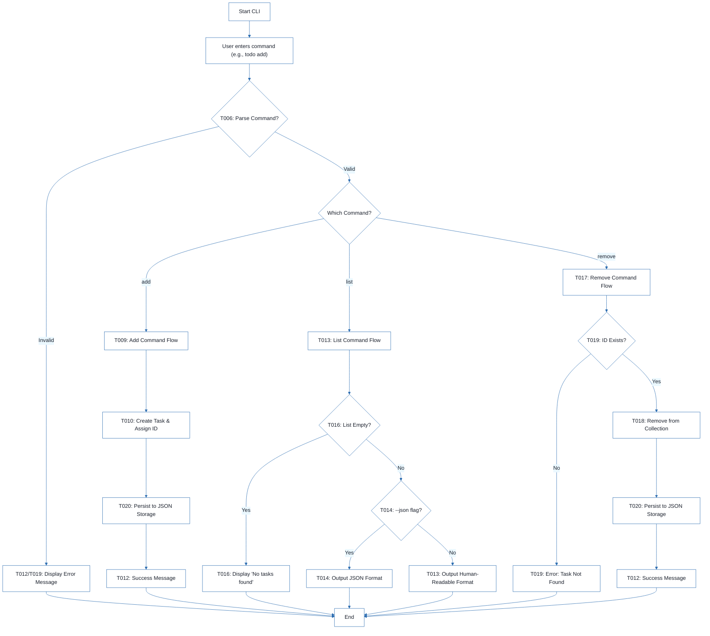

# CLI To-Do List Manager - Technical Specification & Architecture Document

## 1. Executive Summary & Architecture Overview

### 1.1 Executive Brief
The CLI To-Do List Manager is a Python-based command-line application designed for task lifecycle management. It utilizes a local JSON file storage pattern (`~/.todos.json`) and follows a layered architecture consisting of a CLI dispatch layer, a business service layer, and a data persistence layer. The system focuses on sequential ID assignment and state persistence for task creation, completion, and deletion.

### 1.2 Maturity Assessment
The project is READY for execution. While the parser identifies missing formal Acceptance Criteria and a lack of explicit security/performance bounds (e.g., file size limits for the JSON store), the high health index and completeness score indicate that the implementation path is fully mapped. The 'Independent Test' definitions effectively bridge the gap for functional validation.

### 1.3 Technical Stack
* Python
* pyproject.toml

### 1.4 Architectural Constraints
* Sequential ID assignment for task creation.
* Mandatory population of `created_at` timestamps.
* Strict JSON serialization for data persistence.
* Support for human-readable and `--json` output formats.
* Empty-list case explicit handling in CLI.
* Invalid task ID handling (not-found) for removal operations.
* Execution order constraint: Foundational Phase must be complete before any User Story implementation.

### 1.5 Critical Dependencies
* Local filesystem access for `~/.todos.json` storage.
* Sequential ID integrity during task creation.
* Foreign key-like dependency between CLI commands and Service layer logic.
* Persistence integrity for removals and clear operations in `storage.py`.
* Correct mapping of `python -m todo_manager` entry point.

## 2. Architecture Workflows

```mermaid
%%{init: {
  'theme': 'base',
  'themeVariables': {
    'primaryColor': '#1A365D',
    'primaryTextColor': '#1A202C',
    'primaryBorderColor': '#2B6CB0',
    'lineColor': '#2B6CB0',
    'secondaryColor': '#EBF8FF',
    'tertiaryColor': '#EBF8FF',
    'background': '#FFFFFF',
    'mainBkg': '#FFFFFF',
    'secondBkg': '#EBF8FF',
    'tertiaryBkg': '#F7FAFC',
    'secondaryTextColor': '#4A5568',
    'fontSize': '16px',
    'fontFamily': 'Inter, system-ui, sans-serif',
    'nodePadding': '15px',
    'borderRadius': '8px',
    'edgeLabelBackground': '#EBF8FF',
    'clusterBkg': '#F7FAFC',
    'clusterBorder': '#2B6CB0',
    'defaultLinkColor': '#2B6CB0',
    'titleColor': '#1A365D',
    'actorBorder': '#2B6CB0',
    'actorBkg': '#EBF8FF',
    'actorTextColor': '#1A365D',
    'actorLineColor': '#2B6CB0',
    'signalColor': '#2B6CB0',
    'signalTextColor': '#1A202C',
    'labelBoxBorderColor': '#2B6CB0',
    'labelBoxBkgColor': '#EBF8FF',
    'labelTextColor': '#1A202C',
    'loopTextColor': '#1A202C',
    'arrowHeadColor': '#2B6CB0',
    'sequenceNumberColor': '#1A365D',
    'sequenceActorBorder': '#2B6CB0',
    'sequenceActorBkg': '#EBF8FF',
    'sequenceArrowColor': '#2B6CB0',
    'noteBkgColor': '#FFF5EB',
    'noteBorderColor': '#DD6B20',
    'noteTextColor': '#1A202C'
  }
}}%%
flowchart TD
    subgraph S1 ["Phase 1: Setup"]
        PHASE-1["PHASE-1: Setup (Shared Infrastructure)"]
        T001["T001: Create Python package skeleton"]
        T002["T002: Create test directory structure"]
        T003["T003: Add project metadata (pyproject.toml)"]
        PHASE-1 --> T001
        PHASE-1 --> T002
        PHASE-1 --> T003
    end
    subgraph S2 ["Phase 2: Foundational"]
        PHASE-2["PHASE-2: Foundational (Blocking Prerequisites)"]
        T004["T004: Implement task entity definitions"]
        T005["T005: Implement JSON storage I/O"]
        T006["T006: Implement CLI parsing/dispatch"]
        T007["T007: Implement service-layer error handling"]
        T008["T008: Define module entry behavior"]
        PHASE-2 --> T004
        PHASE-2 --> T005
        PHASE-2 --> T006
        PHASE-2 --> T007
        PHASE-2 --> T008
    end
    subgraph S3 ["Phase 3: User Story 1 (MVP)"]
        PHASE-3["PHASE-3: US1 - Add and Manage Tasks"]
        T009["T009: Implement add command flow"]
        T010["T010: Implement task creation/ID assignment"]
        T011["T011: Implement completion updates"]
        T012["T012: Add user-facing messages"]
        PHASE-3 --> T009
        PHASE-3 --> T010
        PHASE-3 --> T011
        PHASE-3 --> T012
    end
    subgraph S4 ["Phase 4: User Story 2"]
        PHASE-4["PHASE-4: US2 - View and Filter Tasks"]
        T013["T013: Implement human-readable listing"]
        T014["T014: Implement --json output formatting"]
        T015["T015: Add listing logic (order/status)"]
        T016["T016: Handle empty-list case"]
        PHASE-4 --> T013
        PHASE-4 --> T014
        PHASE-4 --> T015
        PHASE-4 --> T016
    end
    subgraph S5 ["Phase 5: User Story 3"]
        PHASE-5["PHASE-5: US3 - Remove and Clear Tasks"]
        T017["T017: Implement remove command flow"]
        T018["T018: Implement clear command flow"]
        T019["T019: Add not-found handling for IDs"]
        T020["T020: Ensure storage write persistence"]
        PHASE-5 --> T017
        PHASE-5 --> T018
        PHASE-5 --> T019
        PHASE-5 --> T020
    end
    subgraph S6 ["Phase 6: Polish"]
        PHASE-6["PHASE-6: Polish & Cross-Cutting Concerns"]
        T021["T021: Document CLI usage (README.md)"]
        T022["T022: Add quickstart verification notes"]
        T023["T023: Manual smoke test of all commands"]
        T024["T024: Verify linting and formatting"]
        T025["T025: Confirm JSON output parseability"]
        PHASE-6 --> T021
        PHASE-6 --> T022
        PHASE-6 --> T023
        PHASE-6 --> T024
        PHASE-6 --> T025
    end
    PHASE-2 -->|"depends_on"| PHASE-1
    PHASE-3 -->|"depends_on"| PHASE-2
    PHASE-4 -->|"depends_on"| PHASE-2
    PHASE-5 -->|"depends_on"| PHASE-2
    PHASE-6 -->|"depends_on"| PHASE-3
    PHASE-6 -->|"depends_on"| PHASE-4
    PHASE-6 -->|"depends_on"| PHASE-5
```



```mermaid
%%{init: {
  'theme': 'base',
  'themeVariables': {
    'primaryColor': '#1A365D',
    'primaryTextColor': '#1A202C',
    'primaryBorderColor': '#2B6CB0',
    'lineColor': '#2B6CB0',
    'secondaryColor': '#EBF8FF',
    'tertiaryColor': '#EBF8FF',
    'background': '#FFFFFF',
    'mainBkg': '#FFFFFF',
    'secondBkg': '#EBF8FF',
    'tertiaryBkg': '#F7FAFC',
    'secondaryTextColor': '#4A5568',
    'fontSize': '16px',
    'fontFamily': 'Inter, system-ui, sans-serif',
    'nodePadding': '15px',
    'borderRadius': '8px',
    'edgeLabelBackground': '#EBF8FF',
    'clusterBkg': '#F7FAFC',
    'clusterBorder': '#2B6CB0',
    'defaultLinkColor': '#2B6CB0',
    'titleColor': '#1A365D',
    'actorBorder': '#2B6CB0',
    'actorBkg': '#EBF8FF',
    'actorTextColor': '#1A365D',
    'actorLineColor': '#2B6CB0',
    'signalColor': '#2B6CB0',
    'signalTextColor': '#1A202C',
    'labelBoxBorderColor': '#2B6CB0',
    'labelBoxBkgColor': '#EBF8FF',
    'labelTextColor': '#1A202C',
    'loopTextColor': '#1A202C',
    'arrowHeadColor': '#2B6CB0',
    'sequenceNumberColor': '#1A365D',
    'sequenceActorBorder': '#2B6CB0',
    'sequenceActorBkg': '#EBF8FF',
    'sequenceArrowColor': '#2B6CB0',
    'noteBkgColor': '#FFF5EB',
    'noteBorderColor': '#DD6B20',
    'noteTextColor': '#1A202C'
  }
}}%%
flowchart TD
    START["Start CLI"] --> INPUT["User enters command (e.g., todo add)"]
    INPUT --> PARSE{"T006: Parse Command?"}
    PARSE -->|"Invalid"| ERR_CMD["T012/T019: Display Error Message"]
    ERR_CMD --> END["End"]
    PARSE -->|"Valid"| DISPATCH{"Which Command?"}
    DISPATCH -->|"add"| ADD_FLOW["T009: Add Command Flow"]
    ADD_FLOW --> ADD_LOGIC["T010: Create Task & Assign ID"]
    ADD_LOGIC --> SAVE_ADD["T020: Persist to JSON Storage"]
    SAVE_ADD --> SUCCESS_ADD["T012: Success Message"]
    SUCCESS_ADD --> END
    DISPATCH -->|"list"| LIST_FLOW["T013: List Command Flow"]
    LIST_FLOW --> CHECK_EMPTY{"T016: List Empty?"}
    CHECK_EMPTY -->|"Yes"| MSG_EMPTY["T016: Display 'No tasks found'"]
    CHECK_EMPTY -->|"No"| FMT_DEC{"T014: --json flag?"}
    FMT_DEC -->|"Yes"| JSON_OUT["T014: Output JSON Format"]
    FMT_DEC -->|"No"| HUMAN_OUT["T013: Output Human-Readable Format"]
    MSG_EMPTY --> END
    JSON_OUT --> END
    HUMAN_OUT --> END
    DISPATCH -->|"remove"| REM_FLOW["T017: Remove Command Flow"]
    REM_FLOW --> VAL_ID{"T019: ID Exists?"}
    VAL_ID -->|"No"| ERR_NOTFOUND["T019: Error: Task Not Found"]
    VAL_ID -->|"Yes"| REM_LOGIC["T018: Remove from Collection"]
    REM_LOGIC --> SAVE_REM["T020: Persist to JSON Storage"]
    SAVE_REM --> SUCCESS_REM["T012: Success Message"]
    ERR_NOTFOUND --> END
    SUCCESS_REM --> END
``` & Visual Diagrams

### 2.1 Project Implementation Roadmap & Traceability
Visualizes the phase-based execution order and the mapping of tasks to their respective project phases.

```mermaid
%%{init: {
  'theme': 'base',
  'themeVariables': {
    'primaryColor': '#1A365D',
    'primaryTextColor': '#1A202C',
    'primaryBorderColor': '#2B6CB0',
    'lineColor': '#2B6CB0',
    'secondaryColor': '#EBF8FF',
    'tertiaryColor': '#EBF8FF',
    'background': '#FFFFFF',
    'mainBkg': '#FFFFFF',
    'secondBkg': '#EBF8FF',
    'tertiaryBkg': '#F7FAFC',
    'secondaryTextColor': '#4A5568',
    'fontSize': '16px',
    'fontFamily': 'Inter, system-ui, sans-serif',
    'nodePadding': '15px',
    'borderRadius': '8px',
    'edgeLabelBackground': '#EBF8FF',
    'clusterBkg': '#F7FAFC',
    'clusterBorder': '#2B6CB0',
    'defaultLinkColor': '#2B6CB0',
    'titleColor': '#1A365D',
    'actorBorder': '#2B6CB0',
    'actorBkg': '#EBF8FF',
    'actorTextColor': '#1A365D',
    'actorLineColor': '#2B6CB0',
    'signalColor': '#2B6CB0',
    'signalTextColor': '#1A202C',
    'labelBoxBorderColor': '#2B6CB0',
    'labelBoxBkgColor': '#EBF8FF',
    'labelTextColor': '#1A202C',
    'loopTextColor': '#1A202C',
    'arrowHeadColor': '#2B6CB0',
    'sequenceNumberColor': '#1A365D',
    'sequenceActorBorder': '#2B6CB0',
    'sequenceActorBkg': '#EBF8FF',
    'sequenceArrowColor': '#2B6CB0',
    'noteBkgColor': '#FFF5EB',
    'noteBorderColor': '#DD6B20',
    'noteTextColor': '#1A202C'
  }
}}%%
flowchart TD
    subgraph S1 ["Phase 1: Setup"]
        PHASE-1["PHASE-1: Setup (Shared Infrastructure)"]
        T001["T001: Create Python package skeleton"]
        T002["T002: Create test directory structure"]
        T003["T003: Add project metadata (pyproject.toml)"]
        PHASE-1 --> T001
        PHASE-1 --> T002
        PHASE-1 --> T003
    end
    subgraph S2 ["Phase 2: Foundational"]
        PHASE-2["PHASE-2: Foundational (Blocking Prerequisites)"]
        T004["T004: Implement task entity definitions"]
        T005["T005: Implement JSON storage I/O"]
        T006["T006: Implement CLI parsing/dispatch"]
        T007["T007: Implement service-layer error handling"]
        T008["T008: Define module entry behavior"]
        PHASE-2 --> T004
        PHASE-2 --> T005
        PHASE-2 --> T006
        PHASE-2 --> T007
        PHASE-2 --> T008
    end
    subgraph S3 ["Phase 3: User Story 1 (MVP)"]
        PHASE-3["PHASE-3: US1 - Add and Manage Tasks"]
        T009["T009: Implement add command flow"]
        T010["T010: Implement task creation/ID assignment"]
        T011["T011: Implement completion updates"]
        T012["T012: Add user-facing messages"]
        PHASE-3 --> T009
        PHASE-3 --> T010
        PHASE-3 --> T011
        PHASE-3 --> T012
    end
    subgraph S4 ["Phase 4: User Story 2"]
        PHASE-4["PHASE-4: US2 - View and Filter Tasks"]
        T013["T013: Implement human-readable listing"]
        T014["T014: Implement --json output formatting"]
        T015["T015: Add listing logic (order/status)"]
        T016["T016: Handle empty-list case"]
        PHASE-4 --> T013
        PHASE-4 --> T014
        PHASE-4 --> T015
        PHASE-4 --> T016
    end
    subgraph S5 ["Phase 5: User Story 3"]
        PHASE-5["PHASE-5: US3 - Remove and Clear Tasks"]
        T017["T017: Implement remove command flow"]
        T018["T018: Implement clear command flow"]
        T019["T019: Add not-found handling for IDs"]
        T020["T020: Ensure storage write persistence"]
        PHASE-5 --> T017
        PHASE-5 --> T018
        PHASE-5 --> T019
        PHASE-5 --> T020
    end
    subgraph S6 ["Phase 6: Polish"]
        PHASE-6["PHASE-6: Polish & Cross-Cutting Concerns"]
        T021["T021: Document CLI usage (README.md)"]
        T022["T022: Add quickstart verification notes"]
        T023["T023: Manual smoke test of all commands"]
        T024["T024: Verify linting and formatting"]
        T025["T025: Confirm JSON output parseability"]
        PHASE-6 --> T021
        PHASE-6 --> T022
        PHASE-6 --> T023
        PHASE-6 --> T024
        PHASE-6 --> T025
    end
    PHASE-2 -->|"depends_on"| PHASE-1
    PHASE-3 -->|"depends_on"| PHASE-2
    PHASE-4 -->|"depends_on"| PHASE-2
    PHASE-5 -->|"depends_on"| PHASE-2
    PHASE-6 -->|"depends_on"| PHASE-3
    PHASE-6 -->|"depends_on"| PHASE-4
    PHASE-6 -->|"depends_on"| PHASE-5
```

### 2.2 CLI Execution Workflow
Models the logic flow of the CLI application from command input to storage persistence, including error handling.



## 3. Detailed Technical Specifications & Business Rules

### 3.1 Requirements Traceability

| ID | Requirement / Task Description | Source Phase | Story / Priority |
| :--- | :--- | :--- | :--- |
| T001 | Create the Python package skeleton | PHASE-1 | N/A |
| T002 | Create the test directory structure in tests/unit/ and tests/integration/ | PHASE-1 | N/A |
| T003 | Add project metadata and tooling entry points in pyproject.toml | PHASE-1 | N/A |
| T004 | Implement task entity definitions and serialization helpers | PHASE-2 | N/A |
| T005 | Implement JSON storage path resolution and file I/O helpers | PHASE-2 | N/A |
| T006 | Implement shared command-line parsing and top-level dispatch | PHASE-2 | N/A |
| T007 | Implement shared service-layer error handling and task collection utilities | PHASE-2 | N/A |
| T008 | Define module entry behavior for python -m todo_manager | PHASE-2 | N/A |
| T009 | Implement the `add` command flow | PHASE-3 | US1 / P1 |
| T010 | Implement task creation, sequential ID assignment, and created_at population | PHASE-3 | US1 / P1 |
| T011 | Implement completion updates for existing tasks | PHASE-3 | US1 / P1 |
| T012 | Add user-facing success and error messages for add and complete operations | PHASE-3 | US1 / P1 |
| T013 | Implement human-readable task listing output | PHASE-4 | US2 / P2 |
| T014 | Implement `--json` output formatting | PHASE-4 | US2 / P2 |
| T015 | Add listing logic that preserves task order and status fields | PHASE-4 | US2 / P2 |
| T016 | Handle the empty-list case with a clear message | PHASE-4 | US2 / P2 |
| T017 | Implement the `remove` command flow | PHASE-5 | US3 / P3 |
| T018 | Implement the `clear` command flow for removing completed tasks | PHASE-5 | US3 / P3 |
| T019 | Add not-found handling for invalid task IDs | PHASE-5 | US3 / P3 |
| T020 | Ensure storage writes persist removals and clears safely | PHASE-5 | US3 / P3 |
| T021 | Document the CLI usage and storage behavior in README.md | PHASE-6 | N/A |
| T022 | Add quickstart verification notes and examples in quickstart.md | PHASE-6 | N/A |
| T023 | Manual smoke test of add, list, complete, remove, and clear | PHASE-6 | N/A |
| T024 | Verify linting and formatting expectations | PHASE-6 | N/A |
| T025 | Confirm generated JSON output remains parseable for --json path | PHASE-6 | N/A |

### 3.2 Security Rules
* **File Permissions**: Access to `~/.todos.json` must be handled according to standard OS user permissions.
* **Input Validation**: CLI inputs must be sanitized to prevent injection or corruption of the JSON storage file.

### 3.3 Data Models
* **Task Entity**:
    * `id`: Sequential Integer (Unique)
    * `description`: String
    * `completed`: Boolean
    * `created_at`: Timestamp (ISO 8601)
* **Storage Format**: JSON array of Task entities stored in a flat file.

## 4. Project Governance & Structural Gaps

### 4.1 Structural Gaps
| Gap ID | Missing Section | Priority | Remediation Advice |
| :--- | :--- | :--- | :--- |
| GAP-01 | Acceptance Criteria | MEDIUM | While 'Independent Tests' provide some criteria, a formal set of Acceptance Criteria per user story would improve quality assurance. |
| GAP-02 | Security & Performance Constraints | LOW | Add constraints regarding JSON file size limits or file permission handling for `~/.todos.json`. |

### 4.2 Remediation & Workflow
1. **Validation**: Use the "Independent Test" descriptions provided in the task list as proxy acceptance criteria.
2. **Verification**: Execute the smoke tests defined in T023 and T025 to ensure functional integrity.
3. **Documentation**: Update `README.md` (T021) to include any discovered performance limits during the polish phase.

## 5. Technical & Domain Glossary (Terminology Reference)

| Term | Category | Context Anchor | Project Definition |
| :--- | :--- | :--- | :--- |
| Checkpoint | TECHNICAL_STACK | PHASE-2 | A synchronization gate ensuring mandatory base components are verified before parallel development of feature sets begins. |
| Foundational | TECHNICAL_STACK | PHASE-2 | The blocking shared infrastructure layer containing core models, storage handlers, and dispatch logic. |
| Goal | BUSINESS_DOMAIN | PHASE-3 | The specific functional outcome a user must achieve to validate a feature set. |
| ID | BUSINESS_DOMAIN | T010 | A unique sequential numeric identifier assigned to each persistent entry. |
| JSON | TECHNICAL_STACK | T005 | The standardized lightweight data-interchange format used for persistent local storage and optional command-line output. |
| MVP | BUSINESS_DOMAIN | PHASE-3 | The minimum viable product scope encompassing only the essential ability to create and mark entries as finished. |
| Organization | TECHNICAL_STACK | Tasks: CLI To-Do List Manager | The structural grouping of atomic work units by their associated user stories. |
| Prerequisites | TECHNICAL_STACK | Tasks: CLI To-Do List Manager | The set of mandatory design and data-model documents required before implementation. |
| README | TECHNICAL_STACK | T021 | The primary documentation file specifying command usage and persistence behavior. |
| Setup | TECHNICAL_STACK | PHASE-1 | The initial phase involving directory skeleton creation and pyproject.toml configuration. |
| T016 | TECHNICAL_STACK | T016 | The specific implementation unit for handling zero-entry states in the listing output. |
| Tests | TECHNICAL_STACK | Tasks: CLI To-Do List Manager | The verification process conducted via quickstart smoke tests rather than automated suites. |
| population in | TECHNICAL_STACK | T010 | The process of assigning a timestamp to the created_at attribute during entry instantiation. |
| todo clear | BUSINESS_DOMAIN | T018 | The operational command used to purge all finished entries from the persistent store. |
| todo list | BUSINESS_DOMAIN | T013 | The operation used to retrieve and display all stored entries in either human-readable or structured format. |
| ⚠️ CRITICAL | TECHNICAL_STACK | PHASE-2 | A high-severity constraint marking a phase that must be fully completed before any dependent work begins. |