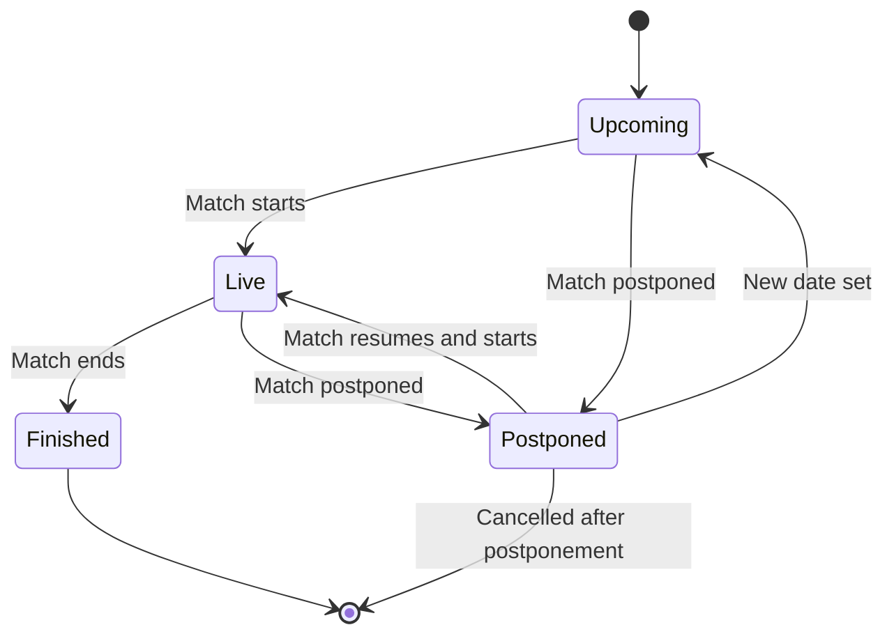

# Data Model: Football Match Manager

## Entities

### Match
Represents a football match

| Field | Type | Description | Validation |
|-------|------|-------------|------------|
| id | UUID | Unique identifier | Required, unique |
| homeTeamId | UUID | Reference to Team | Required, exists |
| awayTeamId | UUID | Reference to Team | Required, exists, not equal to homeTeamId |
| dateTime | DateTime | Match date and time (UTC) | Required, must be in future for upcoming matches |
| venue | String (max 200) | Stadium or location name | Optional |
| leagueId | UUID | Reference to League | Required, exists |
| status | Enum | Match status: upcoming, live, finished, postponed, cancelled | Required, default: upcoming |
| homeScore | Integer | Goals scored by home team | Optional, min 0, default null |
| awayScore | Integer | Goals scored by away team | Optional, min 0, default null |
| lastUpdated | DateTime | Timestamp of last update | Auto-set on update |

**Relationships**:
- Belongs to one League (via leagueId)
- Has two Teams (homeTeamId, awayTeamId)
- Can be followed by many Users (via UserFollow)

### Team
Represents a football team.

| Field | Type | Description | Validation |
|-------|------|-------------|------------|
| id | UUID | Unique identifier | Required, unique |
| name | String (max 100) | Team name | Required |
| abbreviation | String (max 5) | Team abbreviation (e.g., MUN for Manchester United) | Optional, unique per league |
| crestUrl | URL | URL to team crest/logo | Optional, valid URL |
| foundedYear | Integer | Year the club was founded | Optional, min 1800, max current year |

**Relationships**:
- Participates in many Matches (as home or away team)

### League
Represents a football league or tournament

| Field | Type | Description | Validation |
|-------|------|-------------|------------|
| id | UUID | Unique identifier | Required, unique |
| name | String (max 100) | League name (e.g., Premier League, Champions League) | Required |
| sport | String | Sport type (fixed to "football/soccer") | Required, default: "football" |
| country | String (max 100) | Country where league is based | Optional |
| logoUrl | URL | URL to league logo | Optional, valid URL |
| currentSeason | String (e.g., "2023/24") | Current season identifier | Optional |

**Relationships**:
- Has many Matches

### User
Represents an application user (if authentication is implemented)

| Field | Type | Description | Validation |
|-------|------|-------------|------------|
| id | UUID | Unique identifier | Required, unique |
| email | String (email) | User email address | Required, unique, valid email format |
| displayName | String (max 50) | Display name for the user | Required |
| avatarUrl | URL | URL to user avatar/image | Optional, valid URL |
| isActive | Boolean | Whether the user account is active | Required, default: true |
| createdAt | DateTime | Account creation timestamp | Auto-set on create |
| lastLoginAt | DateTime | Last login timestamp | Updated on login |

**Relationships**:
- Can follow many Matches (via UserFollow)

### UserFollow
Represents the relationship between a User and a Match they are following.

| Field | Type | Description | Validation |
|-------|------|-------------|------------|
| userId | UUID | Reference to User | Required, exists |
| matchId | UUID | Reference to Match | Required, exists |
| followedAt | DateTime | Timestamp when the user started following the match | Required, auto-set on create |
| notificationsEnabled | Boolean | Whether the user wants notifications for this match | Optional, default: false |

**Constraints**:
- Composite unique constraint on (userId, matchId) - a user can follow a match only once

**Relationships**:
- Belongs to one User
- Belongs to one Match

## Validation Rules

1. **Match Validation**:
   - A match cannot have the same team as both home and away.
   - Match dateTime must be in the future for status "upcoming".
   - When status changes to "finished", both homeScore and awayScore must be set (non-null).
   - Scores cannot be negative.

2. **Team Validation**:
   - Team name must be unique across all teams (or at least within a league? - for simplicity, global unique).

3. **User Validation**:
   - Email must be unique.
   - Password (if using email/password auth) must meet complexity requirements (min 8 chars, etc.).

4. **UserFollow Validation**:
   - A user can only follow a match once.

## State Transitions (for Match)

## Indexes (for performance)

- Matches: index on (leagueId, dateTime) for filtering by league and date
- Matches: index on (status) for filtering upcoming/live matches
- Teams: index on (name) for search
- Users: index on (email) for authentication
- UserFollow: index on (userId) for getting a user's followed matches
- UserFollow: index on (matchId) for getting followers of a match