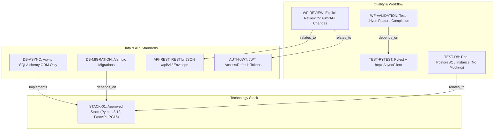
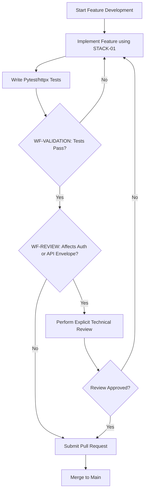
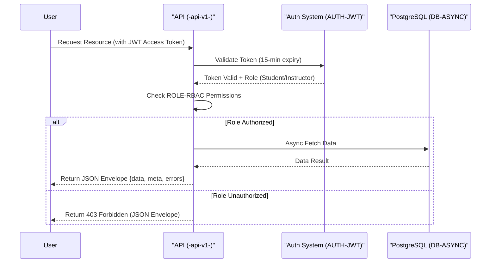

# Learning Platform API - Technical Specification & Architecture Document

## 1. Executive Summary & Architecture Overview

### 1.1 Executive Brief
The Learning Platform API is a high-performance backend designed for educational content management. Hosted on a Python 3.12/FastAPI stack with an asynchronous PostgreSQL 16 persistence layer, it implements a strict RESTful v1 contract. The system enforces a rigid role-based access model separating student progress tracking from instructor course management, utilizing JWT for secure session orchestration.

### 1.2 Maturity Assessment
The specifications exhibit high structural integrity with a health index of 100%, indicating all core technical pillars are defined. While a minor gap exists regarding the documentation of future technical debt or evolving patterns, the current framework is robust and logically consistent. The project is READY for execution.

### 1.3 Technical Stack
*   **Languages and Frameworks**: Python 3.12, FastAPI, PostgreSQL 16, SQLAlchemy 2.0, Alembic, Pydantic v2, pytest, httpx, Resend.
*   **Architectural Constraints**:
    *   Business logic coverage $\ge$ 80%.
    *   JWT access token expiry: 15 minutes; Refresh token expiry: 7 days.
    *   API Versioning: `/api/v1/` path.
    *   Response Format: `{"data": ..., "meta": ..., "errors": []}`.
    *   Database access: Strictly asynchronous SQLAlchemy ORM; Raw SQL prohibited.
    *   Database Testing: Mandatory real PostgreSQL instance; Mocking of DB layer prohibited.
    *   Role Isolation: Instructors only for course CRUD; Students only for enrollment and progress submission.
    *   Review Gates: Explicit review required for authentication, authorization, and response envelope modifications.

### 1.4 Architectural Constraints
The system is bound by a strict "Constitution" that supersedes ad hoc implementation choices. All data access must be non-blocking (async), and all schema evolutions must be versioned via Alembic. The API must maintain backward compatibility within the v1 namespace.

### 1.5 Critical Dependencies
*   `RESEND_API_KEY` environment variable for email delivery.
*   Resend Python SDK for transactional emails.
*   Alembic for all schema migrations and state transitions.
*   Strong relational dependency between schema changes and API documentation updates.
*   Strict foreign key and state integrity for User-Course-Enrollment flows.

## 2. Architecture Workflows & Visual Diagrams

### Technical Constitution Traceability Map
> Maps the relationships between technology standards, coding rules, and workflow constraints using exact identifiers.

### Feature Implementation & Review Workflow
> Models the development lifecycle from implementation to merge, incorporating the mandatory review and testing gates.

### Authentication & Authorization Sequence
> Illustrates the interaction between the User, API, and Auth system based on the JWT and RBAC rules.

## 3. Detailed Technical Specifications & Business Rules

### 3.1 Requirements Traceability

| Identifier | Type | Requirement / Rule Description | Source Section |
| :--- | :--- | :--- | :--- |
| **STACK-01** | Tool Configuration | Approved stack: Python 3.12, FastAPI, PostgreSQL 16, SQLAlchemy 2.0 (async), Alembic, Pydantic v2. | I. Technology Standardization |
| **AUTH-JWT** | Coding Standard | JWT authentication: 15-min expiry access tokens, 7-day expiry refresh tokens. | II. Authentication and Authorization |
| **ROLE-RBAC** | Rule | Two roles only: student (enroll/submit progress) and instructor (create/edit/delete courses). | II. Authentication and Authorization |
| **API-REST** | Coding Standard | RESTful JSON API versioned under /api/v1/ with envelope: {'data': ..., 'meta': ..., 'errors': []}. | III. API Contract and Response Shape |
| **DB-ASYNC** | Rule | Asynchronous database access only via SQLAlchemy ORM; raw SQL prohibited. | IV. Data Access and Persistence |
| **DB-MIGRATION** | Rule | Schema changes must be managed exclusively via Alembic migrations. | IV. Data Access and Persistence |
| **TEST-PYTEST** | Testing Gate | Use pytest with httpx AsyncClient; target 80% business logic coverage. | V. Quality and Testing |
| **TEST-DB** | Testing Gate | Database tests must use a real PostgreSQL instance; no mocking of the database layer. | V. Quality and Testing |
| **TOOL-RESEND** | Tool Configuration | Email delivery via Resend Python SDK using RESEND_API_KEY env variable. | Additional Constraints |
| **WF-VALIDATION** | Workflow Constraint | Features must be validated through tests before completion. | Development Workflow |
| **WF-REVIEW** | Workflow Constraint | Explicit review required for changes to auth, authorization, or response envelopes. | Development Workflow |

### 3.2 Security Rules
*   **Authentication**: Mandatory JWT implementation with short-lived access tokens (15m) and long-lived refresh tokens (7d).
*   **Authorization**: Strict RBAC. Instructors have full CRUD on courses; Students are limited to enrollment and progress submission.
*   **Validation**: All security-sensitive behaviors must be validated via integration-style tests.

### 3.3 Data Models
*   **Persistence**: PostgreSQL 16.
*   **Access Pattern**: Asynchronous ORM via SQLAlchemy 2.0.
*   **Schema Management**: Versioned migrations via Alembic.
*   **Validation**: Pydantic v2 for all request/response data shapes.

## 4. Project Governance & Structural Gaps

### 4.1 Structural Gaps
| Gap | Priority | Remediation Advice |
| :--- | :--- | :--- |
| Open Questions & Uncertainties | LOW | The document is a formal ratification; add a section for evolving technical debt or undecided architectural patterns. |

### 4.2 Remediation & Workflow
Any deviation from the established standards requires documented justification and a formal review process before the code can be merged into the main branch.

## 5. Technical & Domain Glossary (Terminology Reference)

| Term | Category | Context Anchor | Project Definition |
| :--- | :--- | :--- | :--- |
| API | TECHNICAL_STACK | API-REST | RESTful interface versioned under /api/v1/ utilizing a standardized envelope containing data, meta, and errors. |
| AsyncClient | TECHNICAL_STACK | TEST-PYTEST | httpx component utilized within pytest to perform non-blocking request validation. |
| II | TECHNICAL_STACK | II. Authentication and Authorization | Structural section identifier designating the security and access control specifications. |
| III | TECHNICAL_STACK | III. API Contract and Response Shape | Structural section identifier designating the interface exchange format and response structure. |
| IV | TECHNICAL_STACK | IV. Data Access and Persistence | Structural section identifier designating the persistence layer and data retrieval constraints. |
| JSON | TECHNICAL_STACK | API-REST | The mandatory lightweight data-interchange format for all system responses. |
| JWT | TECHNICAL_STACK | AUTH-JWT | Compact, URL-safe means of representing claims to be transferred between two parties, with a 15-minute access and 7-day refresh lifespan. |
| Last Amended | BUSINESS_DOMAIN | Learning Platform API Constitution | The most recent date of modification for the governing technical document. |
| ORM | TECHNICAL_STACK | DB-ASYNC | The exclusive mechanism for performing database interactions, prohibiting the use of direct query strings. |
| PostgreSQL | TECHNICAL_STACK | STACK-01 | Version 16 relational database engine used for primary storage and testing instances. |
| Python 3.12 | TECHNICAL_STACK | STACK-01 | The mandatory runtime environment and language specification for all project implementations. |
| SDK | TECHNICAL_STACK | TOOL-RESEND | The specific Python library provided by the external transactional mail platform for message delivery. |
| SQL | TECHNICAL_STACK | DB-ASYNC | Raw structured query language, the use of which is strictly forbidden in favor of the mapped persistence layer. |
| SQLAlchemy 2.0 | TECHNICAL_STACK | STACK-01 | The toolkit used for database abstraction, strictly requiring asynchronous execution patterns. |