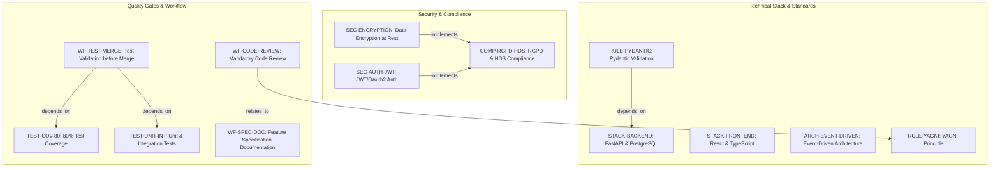
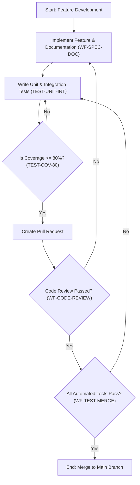

# MediReserve - Technical Specification & Architecture Document

## 1. Executive Summary & Architecture Overview

### 1.1 Executive Brief
MediReserve is a secure healthcare application utilizing an Event-Driven Architecture to ensure scalability and reactivity. The system implements a Python FastAPI backend with PostgreSQL and a React TypeScript frontend, strictly adhering to RGPD and HDS standards for sensitive health data processing. The core value proposition centers on high-integrity data handling, mandatory encryption at rest, and a rigorous quality-gated development workflow.

### 1.2 Maturity Assessment
The project specifications are highly stable and structurally sound, exhibiting a strong alignment between security requirements and technical implementation. While a minor low-severity gap exists regarding the absence of a formal 'Open Questions' section, the comprehensive definition of testing gates and compliance standards renders the project READY for execution.

### 1.3 Technical Stack
* **Languages & Frameworks**: Python, FastAPI, React, TypeScript
* **Database**: PostgreSQL
* **Security**: JWT, OAuth2
* **Data Validation**: Pydantic
* **Documentation**: OpenAPI

### 1.4 Architectural Constraints
* **Data Security**: Mandatory data-at-rest encryption and strict compliance with RGPD and HDS health data standards.
* **System Design**: Event-Driven Architecture required for all asynchronous processes.
* **Quality Gates**: Minimum test coverage >= 80% for all new code; mandatory unit and integration tests for every new module.
* **Development Discipline**: Strict adherence to the YAGNI (You Ain't Gonna Need It) principle to prevent over-engineering.
* **Workflow**: Mandatory code review for all changes; automated tests must pass prior to merge into the main branch.
* **Validation**: Strict input/output validation via Pydantic schemas.

### 1.5 Critical Dependencies
* **HDS (Hébergeur de Données de Santé)** certified hosting environment.
* **RGPD compliance framework** for health data processing.
* **JWT/OAuth2 identity provider** for authentication and authorization.
* **Strict dependency**: Automated test success (Unit & Integration) $\rightarrow$ Branch Merge.
* **Strict dependency**: Pydantic schema validation $\rightarrow$ FastAPI backend integrity.
* **Referential link**: Feature implementation $\rightarrow$ Associated specification documentation.

## 2. Architecture Workflows & Visual Diagrams

### 2.1 Technical Governance & Traceability
This diagram maps the relationship between security compliance, the technical stack, and the quality gates.

### 2.2 Development Lifecycle Workflow
The mandatory process for code changes from implementation to merge.

## 3. Detailed Technical Specifications & Business Rules

### 3.1 Requirements Traceability

| Identifier | Type | Requirement / Rule Description | Source Section |
| :--- | :--- | :--- | :--- |
| **COMP-RGPD-HDS** | Requirement | Conformité obligatoire aux normes RGPD et HDS pour le traitement des données de santé. | Sécurité et Conformité Santé |
| **SEC-ENCRYPTION** | Rule | Le chiffrement des données au repos est obligatoire. | Sécurité et Conformité Santé |
| **SEC-AUTH-JWT** | Tool Config | Gestion de l'authentification et l'autorisation via JWT ou OAuth2. | Sécurité et Conformité Santé |
| **STACK-BACKEND** | Tool Config | Backend basé sur Python FastAPI et PostgreSQL. | Stack Technique & Architecture |
| **STACK-FRONTEND** | Tool Config | Frontend développé avec React et TypeScript. | Stack Technique & Architecture |
| **ARCH-EVENT-DRIVEN** | Coding Std | Architecture orientée événements pour la scalabilité et la réactivité. | Stack Technique & Architecture |
| **TEST-COV-80** | Testing Gate | Couverture de tests minimale de 80% pour tout nouveau code. | Qualité et Rigueur du Code |
| **RULE-PYDANTIC** | Coding Std | Validation des données d'entrée/sortie via schémas Pydantic. | Qualité et Rigueur du Code |
| **DOC-OPENAPI** | Tool Config | Génération automatique et maintenance de la documentation via OpenAPI. | Qualité et Rigueur du Code |
| **TEST-UNIT-INT** | Testing Gate | Inclusion obligatoire de tests unitaires et d'intégration pour tout nouveau module. | Validation et Tests |
| **RULE-YAGNI** | Coding Std | Application stricte du principe YAGNI pour éviter la sur-ingénierie. | Simplicité et Maintenabilité |
| **WF-CODE-REVIEW** | Workflow | Toutes les modifications de code doivent passer par une revue de code. | Processus de Développement |
| **WF-TEST-MERGE** | Workflow | Validation et succès des tests automatisés requis avant merge vers la branche principale. | Processus de Développement |
| **WF-SPEC-DOC** | Requirement | Chaque fonctionnalité doit être documentée dans son fichier de spécification associé. | Processus de Développement |

### 3.2 Security Rules
* **Data Protection**: All health data must be processed according to RGPD and HDS standards (`COMP-RGPD-HDS`).
* **Encryption**: Mandatory encryption for all data at rest (`SEC-ENCRYPTION`).
* **Access Control**: Authentication and authorization must be handled via JWT or OAuth2 (`SEC-AUTH-JWT`).

### 3.3 Data Models
* **Validation**: All data models for input and output must be strictly defined using Pydantic schemas to ensure backend integrity (`RULE-PYDANTIC`).
* **Persistence**: Relational data storage is managed via PostgreSQL (`STACK-BACKEND`).

## 4. Project Governance & Structural Gaps

### 4.1 Structural Gaps
| Gap | Priority | Remediation Advice |
| :--- | :--- | :--- |
| Missing "Open Questions & Uncertainties" section | LOW | Add a dedicated section to list technical points still under discussion or identified architectural debts. |

### 4.2 Remediation & Workflow
The project follows a strict governance where the architecture charter prevails over all other development practices. Any modification to these principles requires:
1. A version update.
2. Documentation of changes.
3. Validation by the architectural team.

## 5. Technical & Domain Glossary (Terminology Reference)

| Term | Category | Context Anchor | Project Definition |
| :--- | :--- | :--- | :--- |
| API | TECHNICAL_STACK | DOC-OPENAPI | The interface layer implemented via FastAPI with automatic documentation generation. |
| Communication | TECHNICAL_STACK | ARCH-EVENT-DRIVEN | The asynchronous interaction model utilizing an event-oriented paradigm for scalability. |
| Frontend | TECHNICAL_STACK | STACK-FRONTEND | The user interface layer built with React for a robust visual experience. |
| HDS | BUSINESS_DOMAIN | COMP-RGPD-HDS | The mandatory certification for hosting medical data within the French healthcare ecosystem. |
| JWT | TECHNICAL_STACK | SEC-AUTH-JWT | The token-based mechanism used to secure authentication and authorization flows. |
| Persistance | TECHNICAL_STACK | STACK-BACKEND | The long-term data storage layer managed by PostgreSQL. |
| RGPD | BUSINESS_DOMAIN | COMP-RGPD-HDS | The European legal framework governing the processing and protection of personal data. |
| TypeScript | TECHNICAL_STACK | STACK-FRONTEND | The strictly typed superset of JavaScript used to ensure interface robustness. |
| YAGNI | TECHNICAL_STACK | RULE-YAGNI | The development discipline of avoiding the creation of features until they are strictly necessary. |