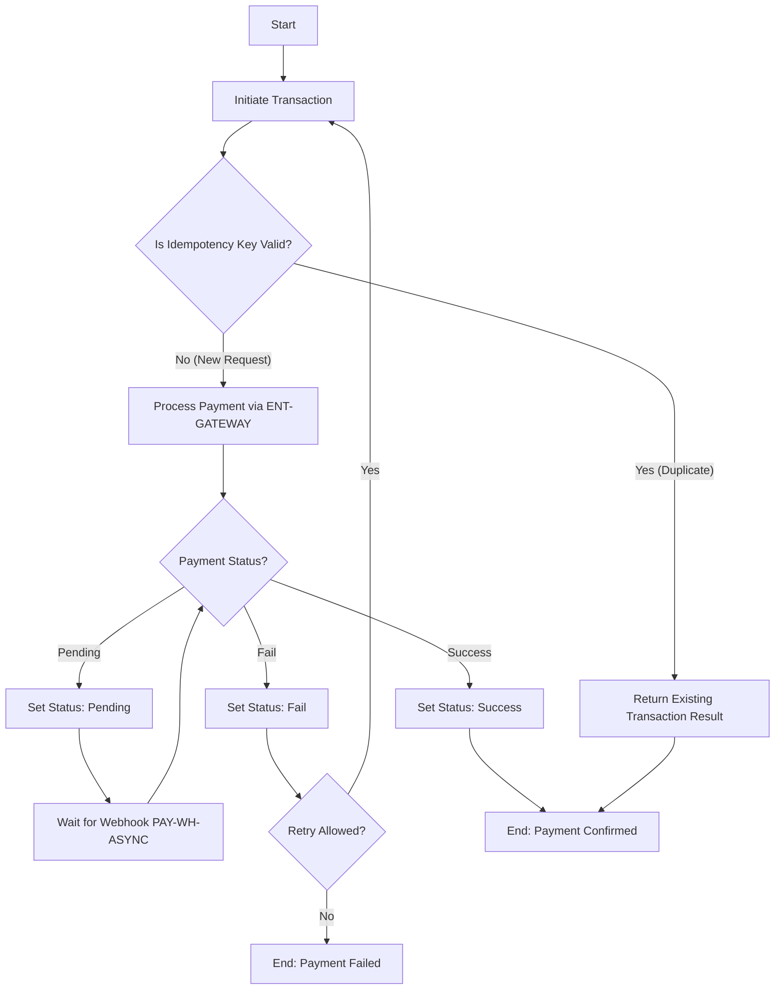
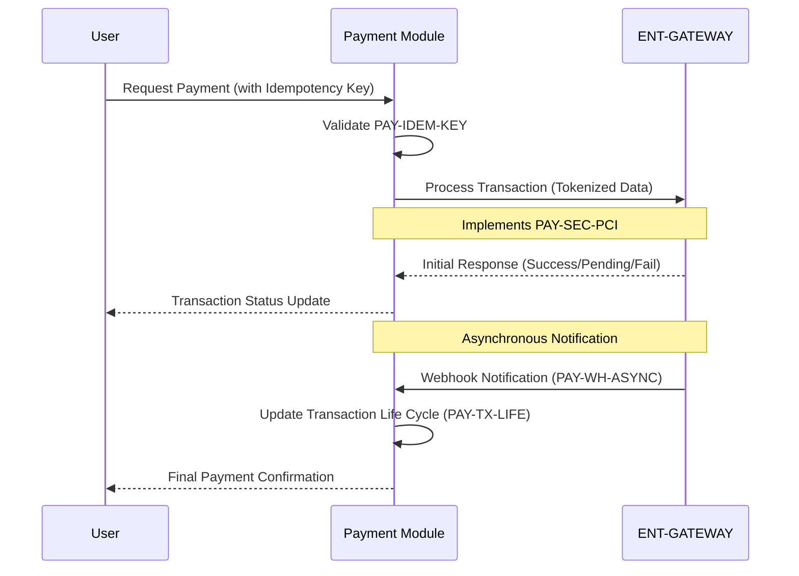
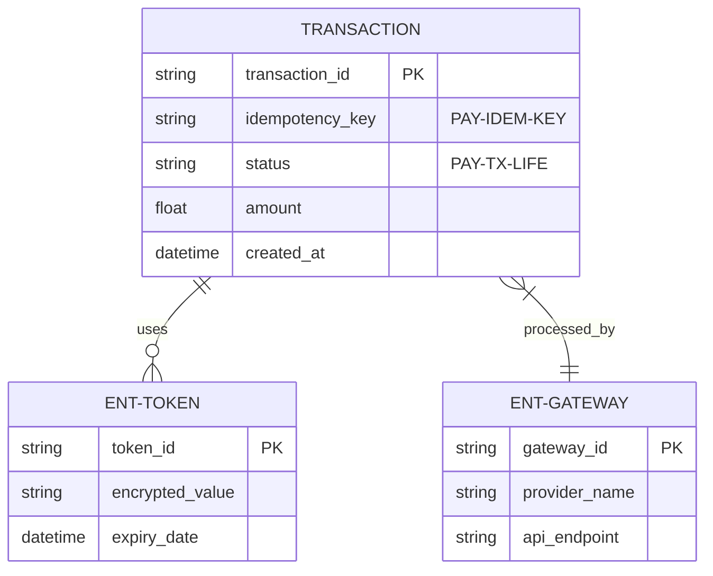
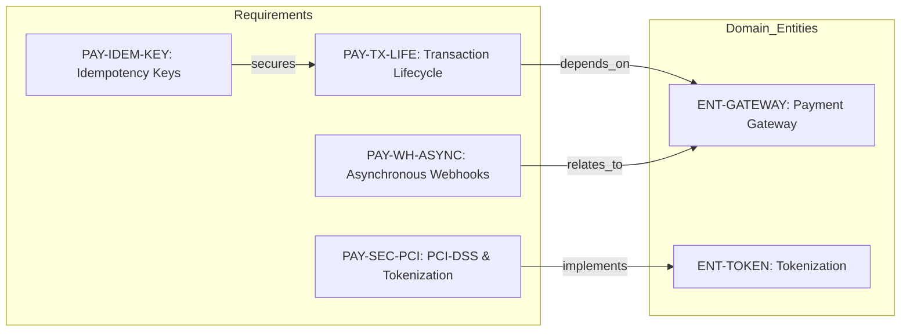

# Module de Paiement - Technical Specification & Architecture Document

## 1. Executive Summary & Architecture Overview

### 1.1 Executive Brief
The Payment Module is a decoupled architectural service designed for secure financial transaction processing. It integrates multiple external gateways via an adapter pattern, utilizing tokenization and idempotency keys to ensure data security and transactional integrity. The system manages the full transaction lifecycle from initiation to final status resolution through asynchronous webhook processing.

### 1.2 Maturity Assessment
The project is currently in the **REFINEMENT** stage. While the core functional flow and security standards are well-defined, there is a critical lack of boundary definition (Scope) and a total absence of performance benchmarks such as latency and throughput thresholds. The architectural skeleton is present, but execution is blocked by these structural gaps in the specification.

### 1.3 Technical Stack
*   **External Gateways**: Stripe, PayPal
*   **Security Standards**: PCI-DSS
*   **Communication**: REST API, Webhooks (Asynchronous)

### 1.4 Architectural Constraints
*   Compliance with PCI-DSS security standards.
*   Mandatory use of tokenization to prohibit sensitive data storage.
*   Enforcement of idempotency keys for all retry operations to prevent double debits.
*   Asynchronous processing for all provider-sent webhook notifications.
*   Decoupled service architecture for multi-gateway support.

### 1.5 Critical Dependencies
*   **External Payment Gateways**: Stripe, PayPal for transaction processing.
*   **Relational Dependency**: Strict link between Transaction Lifecycle (`PAY-TX-LIFE`) and Payment Gateway entities.
*   **Webhook Mechanism**: Reliable delivery from third-party providers to the internal listener.
*   **Tokenization Service**: Essential for maintaining PCI-DSS compliance.

## 2. Architecture Workflows & Visual Diagrams

### 2.1 Payment Transaction Lifecycle Workflow
Models the end-to-end flow of a payment transaction including idempotency checks and failure handling.

### 2.2 Payment Processing Sequence
Interaction between the User, Payment Module, and the External Payment Gateway.

### 2.3 Payment Domain Data Model
Entity relationship diagram for the payment module focusing on transactions and security tokens.

### 2.4 Requirements Traceability Matrix
Maps functional and non-functional requirements to the domain entities they implement or depend on.

## 3. Detailed Technical Specifications & Business Rules

### 3.1 Requirements Traceability
| ID | Type | Requirement Description | Source Section |
| :--- | :--- | :--- | :--- |
| **PAY-TX-LIFE** | Functional | Gestion du cycle de vie complet d'une transaction (Initiation -> Pending -> Success/Fail). | 2. System Architecture & Technical Specifications |
| **PAY-SEC-PCI** | Non-Functional | Implémentation du standard PCI-DSS et utilisation de tokens pour éviter le stockage des données sensibles. | 2. System Architecture & Technical Specifications |
| **PAY-IDEM-KEY** | Functional | Mise en place de clés d'idempotence pour éviter les doubles débits en cas de retry. | 2. System Architecture & Technical Specifications |
| **PAY-WH-ASYNC** | Functional | Système d'écoute et de traitement asynchrone des notifications webhooks envoyées par les prestataires de paiement. | 2. System Architecture & Technical Specifications |

### 3.2 Security Rules
*   **PCI-DSS Compliance**: All transaction processing must adhere to PCI-DSS standards (`PAY-SEC-PCI`).
*   **Data Minimization**: Sensitive card data must never be stored in the local database; only non-sensitive tokens (`ENT-TOKEN`) are permitted.
*   **Integrity**: Idempotency keys (`PAY-IDEM-KEY`) must be validated before any transaction processing to prevent duplicate financial operations.

### 3.3 Data Models
*   **Transaction**: Tracks the state (`PAY-TX-LIFE`), amount, and the associated idempotency key.
*   **Token**: Stores the encrypted surrogate value and expiry date for a payment method.
*   **Gateway**: Stores provider-specific configuration (API endpoints, provider names).

## 4. Project Governance & Structural Gaps

### 4.1 Structural Gaps
| Missing Section | Priority | Remediation Advice |
| :--- | :--- | :--- |
| **Scope & Out-of-Scope** | HIGH | Définir explicitement les frontières du module (ex: gestion des remboursements est-elle incluse ?). |
| **Open Questions & Uncertainties** | MEDIUM | Lister les incertitudes liées au choix des passerelles de paiement ou aux contraintes légales locales. |
| **Non-Functional Requirements** | LOW | Bien que présentes dans la section 2, les exigences de performance (latence, débit) devraient être formalisées dans une section dédiée. |

### 4.2 Remediation & Workflow
The project is currently in the processing phase (`doc-pipeline-001`). To move to "Certified PDF Ready" status, the high-priority gap regarding the project scope must be resolved and performance benchmarks must be integrated into the non-functional requirements.

## 5. Technical & Domain Glossary (Terminology Reference)

| Term | Category | Context Anchor | Project Definition |
| :--- | :--- | :--- | :--- |
| API | TECHNICAL_STACK | 4. Architectural Diagrams & Workflows | The primary interface layer enabling communication between the core service and external components. |
| Branch | TECHNICAL_STACK | Specification Document: Documentation d'Architecture du Module de Paiement | The specific version control path used for tracking documentation pipeline iterations. |
| DSS | TECHNICAL_STACK | PAY-SEC-PCI | The security standard governing the protection of cardholder data within the financial processing environment. |
| ID | BUSINESS_DOMAIN | PAY-TX-LIFE | A unique alphanumeric string used to distinguish a specific financial transaction within the system. |
| Idempotence | BUSINESS_DOMAIN | PAY-IDEM-KEY | A design property ensuring that repeated requests with the same key result in only one state change to prevent duplicate charges. |
| PCI | TECHNICAL_STACK | PAY-SEC-PCI | The global regulatory framework for securing sensitive credit card information. |
| PDF | TECHNICAL_STACK | Specification Document: Documentation d'Architecture du Module de Paiement | The final portable document format required for the certification of the architecture specification. |
| PayPal | TECHNICAL_STACK | 2. System Architecture & Technical Specifications | One of the supported third-party financial intermediaries used to process monetary exchanges. |
| Sécurisation | BUSINESS_DOMAIN | 2. System Architecture & Technical Specifications | The set of measures and protocols applied to safeguard financial data against unauthorized access. |
| Tokenisation | BUSINESS_DOMAIN | ENT-TOKEN | The method of replacing sensitive financial credentials with non-sensitive surrogates for storage. |
| Webhook | TECHNICAL_STACK | PAY-WH-ASYNC | An asynchronous HTTP callback mechanism used to notify the system of external payment status changes. |
| Webhooks | TECHNICAL_STACK | PAY-WH-ASYNC | The collection of listeners and handlers processing event notifications from external payment providers. |
| Workflow ID | TECHNICAL_STACK | Specification Document: Documentation d'Architecture du Module de Paiement | The unique tracking identifier assigned to the document processing pipeline. |